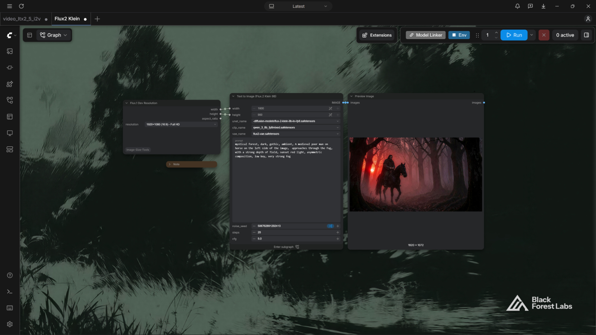
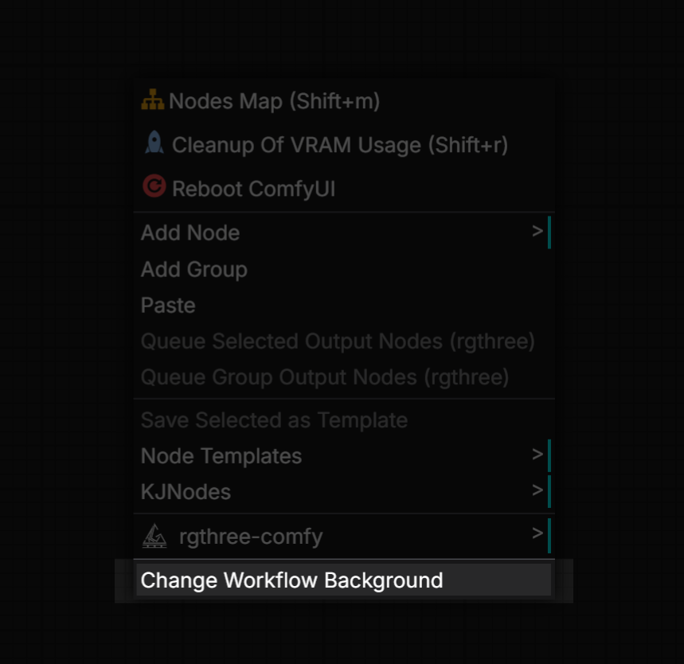
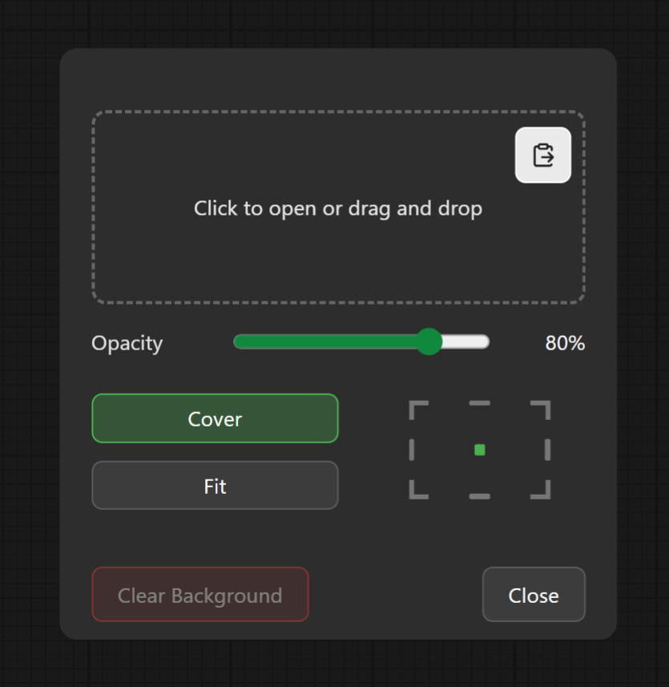
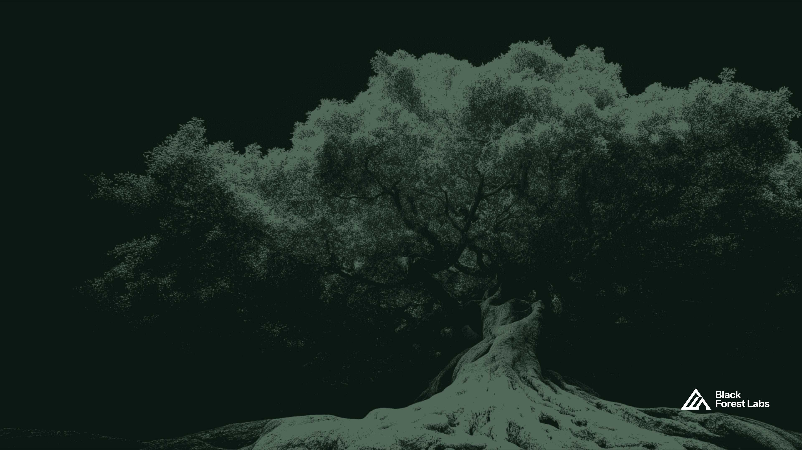
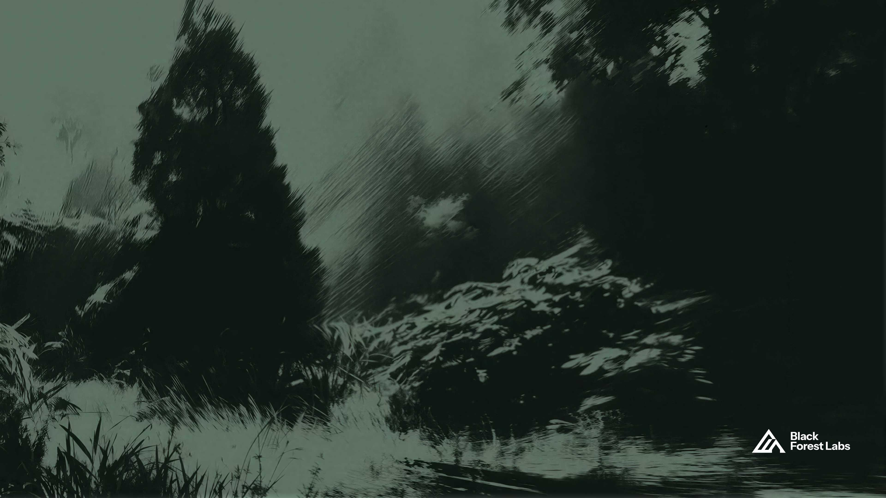

# Custom ComfyUI Workflow Wallpapers

It allows you to set custom background images for workflows.



## Install

Copy this folder into your ComfyUI `custom_nodes` directory and restart ComfyUI:

```
custom_nodes/comfyui-workflow-background
```

## Usage

1. Right-click an empty canvas area.
2. Choose **Change Workflow Background**.

   
3. Pick an image (browse, drop, or paste), adjust opacity / fit / position, press **Close**.

   
4. Save the workflow (Ctrl+S) so the background setting is stored.

- The image is NOT embedded in the workflow JSON - only the file name is stored in the workflow `extra` data.
- The image is uploaded to the ComfyUI `input/backgrounds` folder.

## Storage format

Saved under `extra.canvasBackgroundImage` in the workflow JSON:

```json
{
  "filename": "my-bg.png",
  "subfolder": "backgrounds",
  "type": "input",
  "opacity": 80,
  "fit": "cover",
  "position": "center"
}
```

## Sample wallpapers

From`sample_wallpapers` folder.






